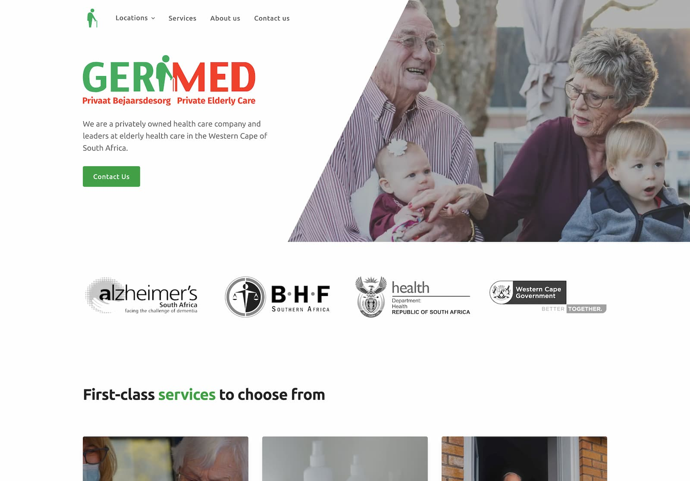
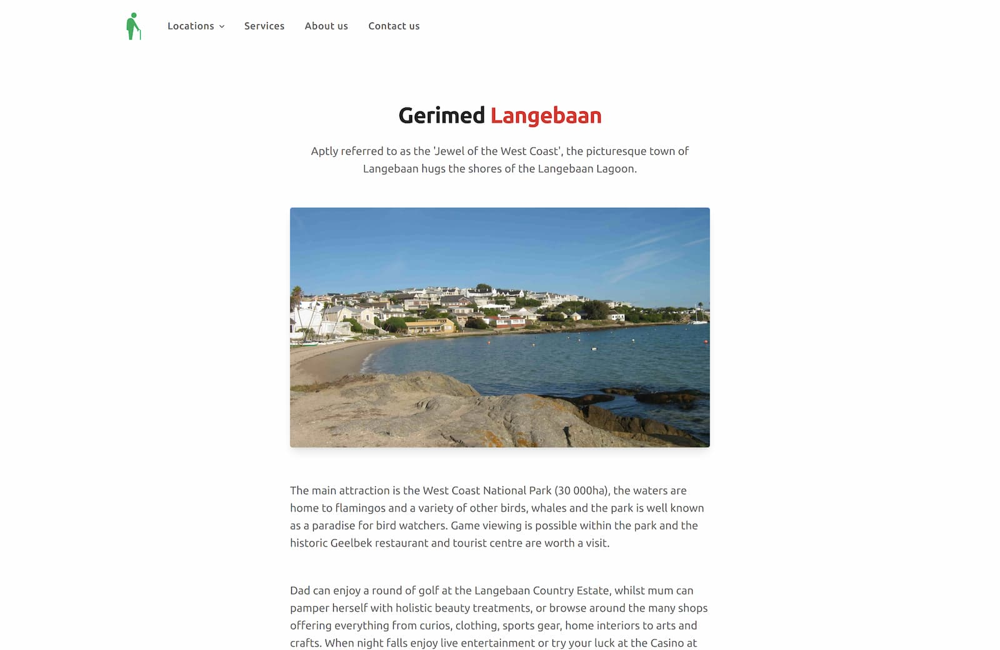
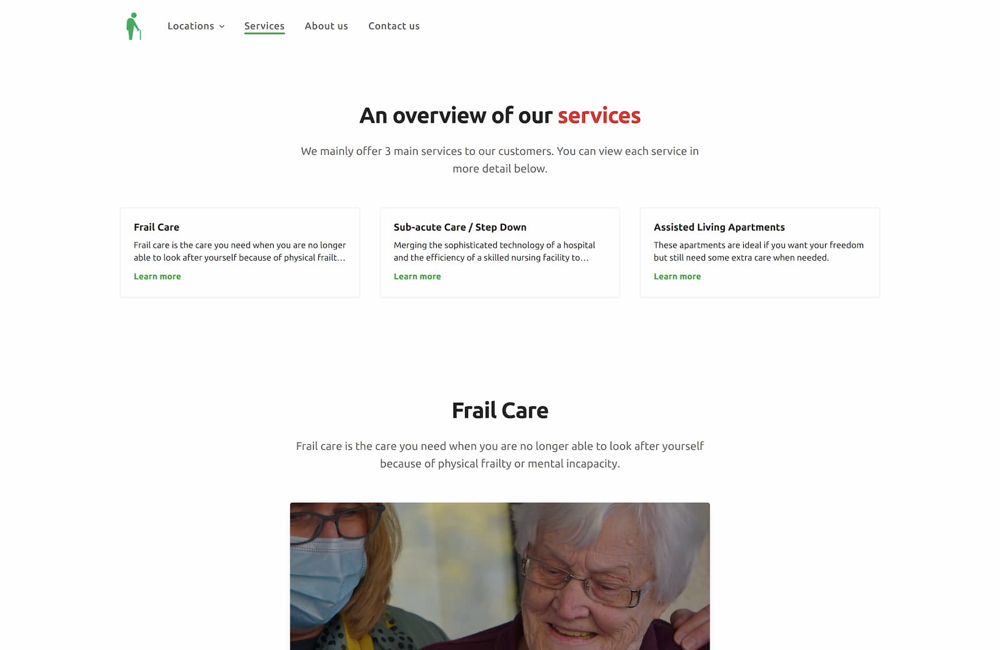
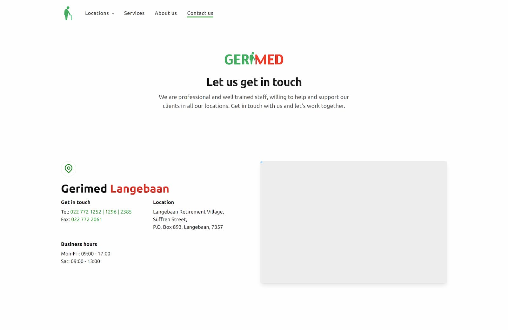

# Gerimed website

A privately owned health care business that's been in business since 2001 needed a new developer to rebuild and modernize their website. They had their website built at the start of their venture and saw the effects of not updating in such a long time.

## Screenshots

 

 

 

## Tech Stack

**Client:**

## Related

Previous iterations of this project.

- [Gerimed-v1](https://github.com/IamStephan/gerimed-v1)

